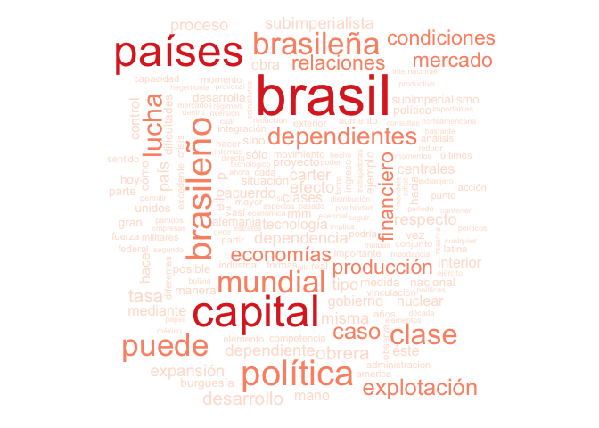
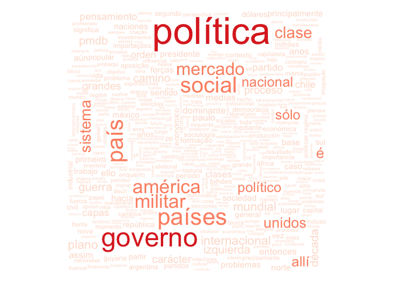

<!-- README.md is generated from README.Rmd. Please edit that file -->

# marini

<!-- badges: start -->

[](https://www.tidyverse.org/lifecycle/#experimental)
<!-- badges: end -->

## Installation

``` r
remotes::install_github("tomasbarcellos/marini)
```

## Example

Para conhecer os textos com o termo “subimperislimo” no título podemos
usar:

``` r
library(marini)
library(dplyr)
"subimperialismo" %>% 
  busca_marini() %>% 
  nuvem()
```



Por exemplo as fontes mais comuns são:

``` r
library(stringr)
textos_marini %>% 
  mutate(fonte = str_remove(fonte, "[,\\.].+")) %>% 
  count(fonte, sort = TRUE)
#> # A tibble: 54 x 2
#>    fonte                                    n
#>    <chr>                                <int>
#>  1 Archivo de Ruy Mauro Marini            136
#>  2 El reformismo y la contrarrevolución    28
#>  3 El Sol de México                        26
#>  4 Correo de la Resistencia                20
#>  5 Excélsior                               16
#>  6 Ruy Mauro Marini                        12
#>  7 Punto Final Internacional                7
#>  8 Cuadernos Políticos n                    6
#>  9 El Universal                             4
#> 10 Subdesarrollo y Revolución               4
#> # … with 44 more rows
```

Se quisermos conhecer o conteúdo dos artigos do Sol do México:

``` r
textos_marini %>% 
  mutate(fonte = str_remove(fonte, "[,\\.].+")) %>% 
  filter(fonte == "El Sol de México") %>% 
  nuvem()
```


O exemplo abaixo apresenta os textos que contém o termo rascismo e uma
núvem de palavras de seus conteúdos.

``` r
racismo <- textos_marini %>% 
  filter(str_detect(texto, "racismo")) 

racismo
#> # A tibble: 5 x 5
#>      id titulo           fonte                    ano texto                
#>   <int> <chr>            <chr>                  <dbl> <chr>                
#> 1   109 El camino legal… El reformismo y la co…  1976 "Una de las dificult…
#> 2    71 Brasil: da dita… "Archivo de Ruy Mauro…  1990 "No curso da década …
#> 3    86 Las raíces del … Archivo de Ruy Mauro …  1994 "El pensamiento soci…
#> 4   109 El camino legal… El reformismo y la co…  1976 "Una de las dificult…
#> 5   131 La influencia d… Excélsior, México, 11…  1976 La importancia de Áf…
nuvem(racismo)
```


